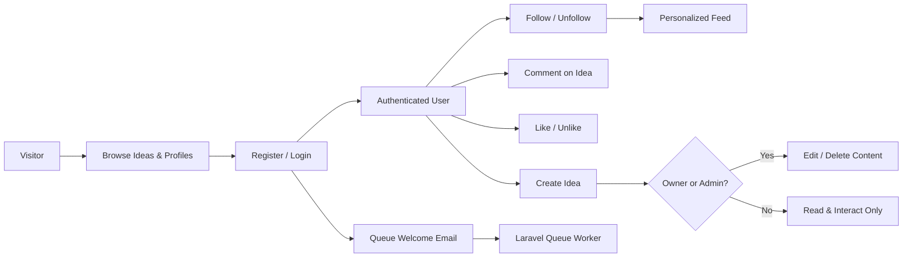
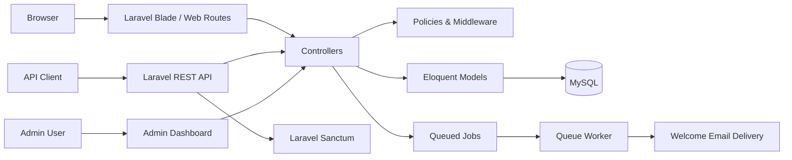

<h1 align="center">Ideas</h1>

<p align="center">
  <strong>Social Idea-Sharing Platform</strong>
</p>

<p align="center">
  A Laravel application where users publish ideas, build connections, interact through likes and comments, and discover a personalized feed.
</p>

<p align="center">
  
  
  
  
  
</p>

<p align="center">
  <a href="#features">Features</a> •
  <a href="#social-workflow">Social Workflow</a> •
  <a href="#architecture">Architecture</a> •
  <a href="#api-highlights">API Highlights</a> •
  <a href="#quick-start">Quick Start</a>
</p>

---

## Overview

Ideas is a Laravel social platform for publishing and discovering short-form ideas. It combines a server-rendered web application, dynamic AJAX interactions, a Laravel Sanctum-protected REST API, an administrative dashboard, and background email processing.

The project focuses on common social-platform backend concerns: ownership-based authorization, relational content models, personalized feeds, social interactions, moderation controls, and clean API responses.

---

## Features

### Social Experience

- User registration and login.
- Create, edit, view, and delete ideas while preserving user formatting.
- Add and delete comments on ideas.
- Like and unlike ideas.
- Follow and unfollow creators.
- User profiles with bios, profile images, and social statistics.
- Personalized feed based on followed users.
- User discovery through top-user listings and search by name or username.

### Authorization & Moderation

- Ownership-based controls for modifying or deleting an idea.
- Admin authorization for elevated content-management actions.
- Protected web routes for posting, commenting, following, and profile management.
- Laravel Sanctum protection for write actions in the REST API.

### Admin Dashboard

- Platform-level statistics for users, ideas, comments, and administrators.
- User search, deletion, and administrator role toggling.
- Idea and comment management for moderation.
- AJAX-powered table actions and inline user edits.

### Performance & Async Work

- Eager loading and model-level relationship loading to reduce unnecessary queries.
- In-memory collection checks where appropriate to avoid repeated database lookups in views.
- Background welcome emails through a Laravel queue job.
- Queue worker support for asynchronous email processing.

---

## Social Workflow



### Ownership Rules

| Action | Access Rule |
| --- | --- |
| Edit an idea | The original author only. |
| Delete an idea | The original author or an administrator. |
| Publish, comment, like, follow | Authenticated users only. |
| Admin dashboard | Authenticated users with admin authorization. |

---

## Architecture



### Main Components

| Component | Responsibility |
| --- | --- |
| **Laravel web application** | Server-rendered dashboard, profile, feed, idea, comment, and admin workflows. |
| **REST API** | JSON endpoints for authenticated social actions and public read access. |
| **Laravel Sanctum** | Token-based authentication for protected API routes. |
| **Policies & middleware** | Enforce ownership and administrator authorization. |
| **Eloquent ORM** | Manage users, ideas, comments, likes, and follower relationships. |
| **Laravel Queues** | Process welcome-email work outside the request-response cycle. |
| **AJAX interactions** | Update likes, follows, and administrative actions without full-page reloads. |

---

## Tech Stack

| Area | Technologies |
| --- | --- |
| **Backend** | PHP, Laravel, Eloquent ORM, Blade, REST APIs, API Resources |
| **Authentication** | Laravel Sanctum and Laravel session authentication |
| **Data** | MySQL, Laravel migrations, relational social models |
| **Authorization** | Laravel policies, `auth` middleware, admin ability checks |
| **Async Processing** | Laravel queues and queued welcome-email job |
| **Frontend Behavior** | Blade templates, AJAX interactions, JavaScript |

---

## API Highlights

### Public Read Access

| Method | Endpoint | Purpose |
| --- | --- | --- |
| `POST` | `/register` | Create an API account. |
| `POST` | `/login` | Authenticate and receive access credentials. |
| `GET` | `/ideas` | Browse published ideas. |
| `GET` | `/ideas/{idea}` | View a single idea. |
| `GET` | `/ideas/{idea}/likes` | View idea likes. |
| `GET` | `/users/{user}` | View a public user profile. |
| `GET` | `/users/{user}/followers` | View followers. |
| `GET` | `/users/{user}/followings` | View followed users. |

### Sanctum-Protected Social Actions

| Area | Example Endpoints |
| --- | --- |
| **Feed** | `GET /feed` |
| **Ideas** | `POST /ideas`, `PUT /ideas/{idea}`, `DELETE /ideas/{idea}` |
| **Comments** | `POST /ideas/{idea}/comments`, `DELETE /ideas/{idea}/comments/{comment}` |
| **Likes** | `POST /ideas/{idea}/like`, `DELETE /ideas/{idea}/unlike` |
| **Follows** | `POST /users/{user}/follow`, `DELETE /users/{user}/unfollow` |
| **Profile** | `PATCH /profile`, `DELETE /profile` |

---

## Repository Structure

```text
.
├── app/
│   ├── Http/
│   │   ├── Controllers/
│   │   │   ├── Api/            # REST API controllers
│   │   │   ├── Admin/          # Admin dashboard controllers
│   │   │   └── web/            # Web application controllers
│   │   ├── Resources/          # API response transformations
│   │   └── Middleware/
│   ├── Jobs/                   # Background jobs, including welcome emails
│   ├── Models/                 # User, Idea, Comment, Like, Follower, and related models
│   └── Policies/               # Ownership and admin authorization policies
├── database/
│   ├── migrations/
│   └── seeders/
├── resources/views/            # Blade views for the platform and admin dashboard
├── routes/
│   ├── web.php                 # Web and admin routes
│   └── api.php                 # REST API routes
└── README.md
```

---

## Quick Start

### Prerequisites

- PHP 8.1+
- Composer
- Node.js and npm
- MySQL or another Laravel-compatible database

### 1. Clone and Install

```bash
git clone https://github.com/YousefAlTohamy/Ideas.git
cd Ideas
composer install
npm install
```

### 2. Configure the Application

```bash
cp .env.example .env
php artisan key:generate
```

Set local database and mail values in `.env`. Never commit real SMTP passwords, API keys, or user data.

### 3. Prepare the Application

```bash
php artisan migrate
php artisan storage:link
npm run build
```

### 4. Run Locally

```bash
php artisan serve
php artisan queue:work
```

For local frontend development:

```bash
npm run dev
```

---

## Project Notes

- The queue worker must be running for welcome emails and other queued tasks to be processed.
- The REST API and server-rendered web application share the same underlying Laravel domain models and authorization rules.
- The repository is intended as a technical showcase of social workflows, authorization, API design, async tasks, and administrative controls.
